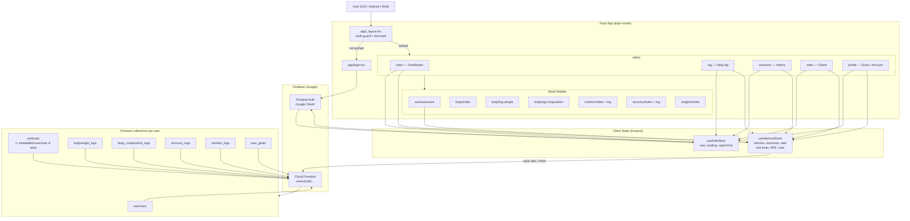
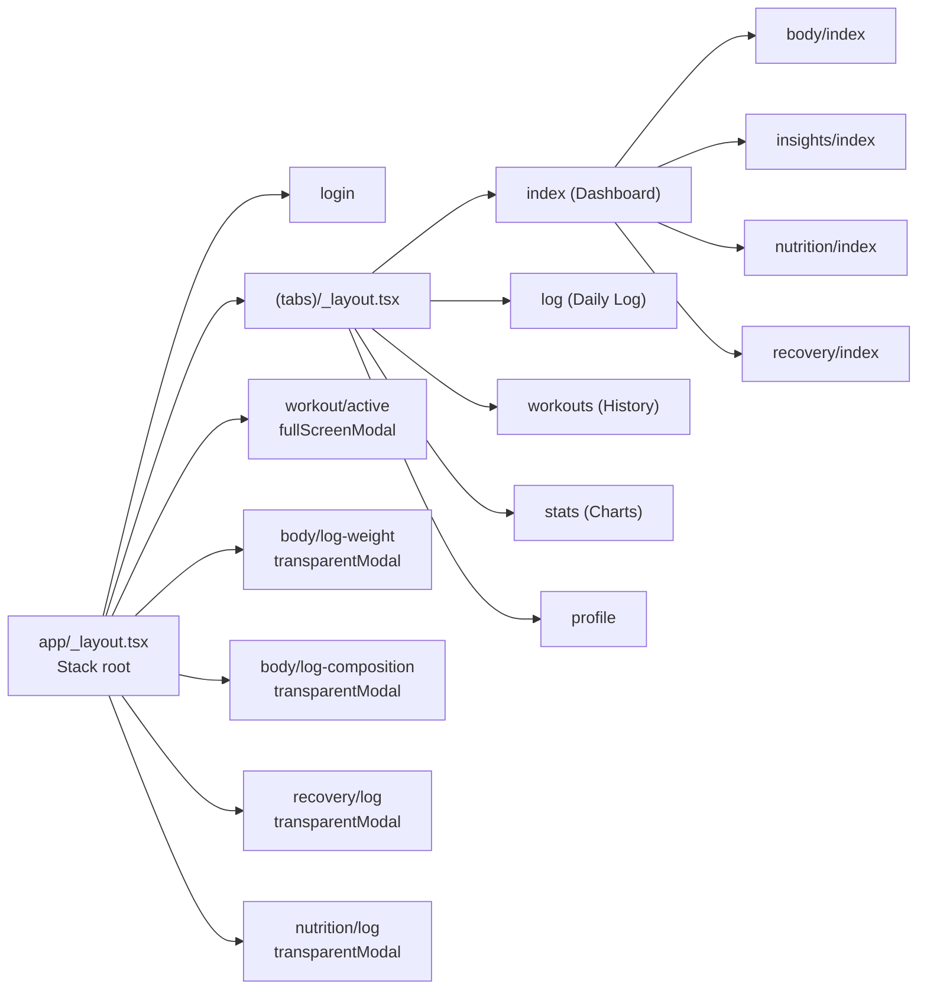
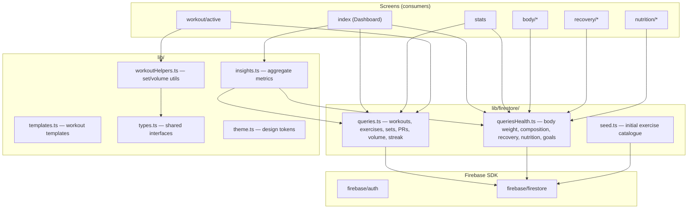
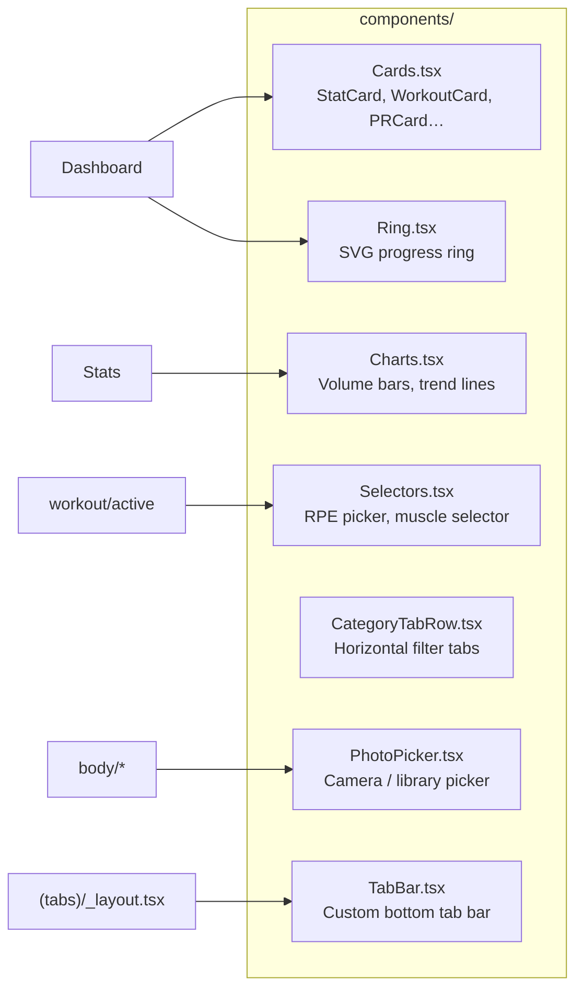
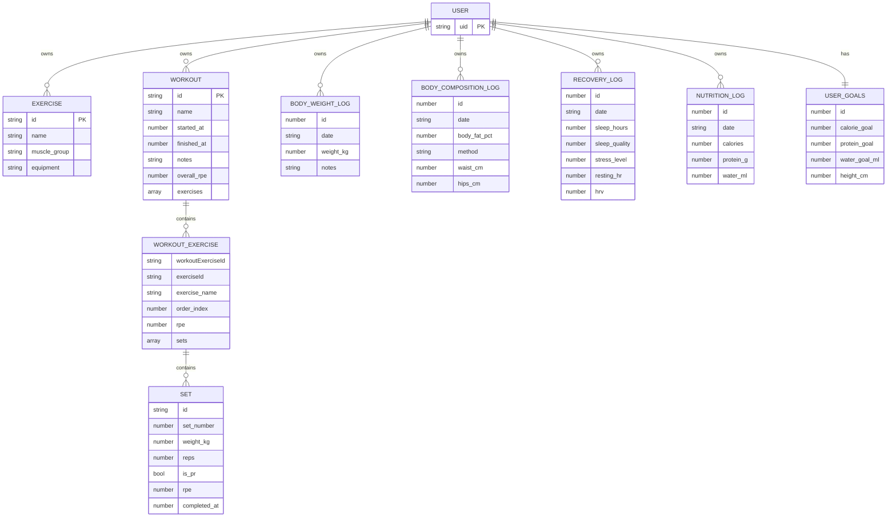

# Architecture

## High-level overview

```mermaid
graph TD
    User["User (iOS / Android / Web)"]

    subgraph Expo["Expo App (expo-router)"]
        Layout["app/_layout.tsx\nAuth guard + font load"]
        Login["app/login.tsx"]

        subgraph Tabs["(tabs)"]
            Home["index — Dashboard"]
            Log["log — Daily log"]
            Workouts["workouts — History"]
            Stats["stats — Charts"]
            Profile["profile — Goals / Account"]
        end

        subgraph Modals["Stack Modals"]
            ActiveWorkout["workout/active"]
            BodyIndex["body/index"]
            LogWeight["body/log-weight"]
            LogComposition["body/log-composition"]
            Nutrition["nutrition/index + log"]
            Recovery["recovery/index + log"]
            Insights["insights/index"]
        end
    end

    subgraph State["Client State (Zustand)"]
        AuthStore["useAuthStore\nuser, loading, signIn/Out"]
        WorkoutStore["useWorkoutStore\nisActive, exercises, sets\nrest timer, RPE, view"]
    end

    subgraph Firebase["Firebase (Google)"]
        FBAuth["Firebase Auth\nGoogle OAuth"]
        Firestore["Cloud Firestore\nusers/{uid}/..."]
    end

    subgraph FirestoreCollections["Firestore collections per user"]
        exercises["exercises"]
        workouts["workouts\n(+ embedded exercises & sets)"]
        bodyweight["bodyweight_logs"]
        composition["body_composition_logs"]
        recovery["recovery_logs"]
        nutrition["nutrition_logs"]
        goals["user_goals"]
    end

    User --> Layout
    Layout -- "not authed" --> Login
    Layout -- "authed" --> Tabs
    Login --> FBAuth
    FBAuth --> AuthStore

    Tabs --> Modals

    Home & Log & Workouts & Stats & Profile --> AuthStore
    Home & Log & Workouts & Stats & Profile --> WorkoutStore

    ActiveWorkout --> WorkoutStore

    WorkoutStore -- "save sets / finish" --> Firestore
    AuthStore --> FBAuth

    Firestore --> FirestoreCollections
    exercises & workouts & bodyweight & composition & recovery & nutrition & goals --> Firestore
```

---

## Routing

```mermaid
graph LR
    Root["app/_layout.tsx\nStack root"]

    Root --> Login["login"]
    Root --> TabsLayout["(tabs)/_layout.tsx"]
    Root --> ActiveWorkout["workout/active\nfullScreenModal"]
    Root --> LogWeight["body/log-weight\ntransparentModal"]
    Root --> LogComposition["body/log-composition\ntransparentModal"]
    Root --> RecoveryLog["recovery/log\ntransparentModal"]
    Root --> NutritionLog["nutrition/log\ntransparentModal"]

    TabsLayout --> Dashboard["index (Dashboard)"]
    TabsLayout --> DailyLog["log (Daily Log)"]
    TabsLayout --> WorkoutsTab["workouts (History)"]
    TabsLayout --> StatsTab["stats (Charts)"]
    TabsLayout --> ProfileTab["profile"]

    Dashboard --> BodyIndex["body/index"]
    Dashboard --> InsightsIndex["insights/index"]
    Dashboard --> NutritionIndex["nutrition/index"]
    Dashboard --> RecoveryIndex["recovery/index"]
```

---

## State management

```mermaid
graph TD
    subgraph AuthStore["useAuthStore (Zustand)"]
        AUser["user: FirebaseUser | null"]
        ALoading["loading: boolean"]
        AInit["init() — subscribes to onAuthStateChanged"]
        ASignIn["signIn() — Google popup"]
        ASignOut["signOut()"]
    end

    subgraph WorkoutStore["useWorkoutStore (Zustand)"]
        WActive["isActive / workoutId / workoutName"]
        WExercises["exercises: ActiveExercise[]"]
        WView["workoutView: logging | picker | resting | rpe | summary"]
        WRest["restTimerEnd / restDuration"]
        WRPE["overallRpe / perExerciseRpe"]
        WActions["startWorkout · addSet · startRestTimer\nfinishWorkout · reset"]
    end

    Layout["app/_layout.tsx"] --> AInit
    Login["login.tsx"] --> ASignIn
    ProfileTab["profile.tsx"] --> ASignOut
    ActiveWorkout["workout/active.tsx"] --> WActions
    ActiveWorkout --> WActive
    ActiveWorkout --> WExercises
    ActiveWorkout --> WView
```

---

## Data layer

```mermaid
graph TD
    subgraph FirestoreLayer["lib/firestore/"]
        FQ["queries.ts — workouts, exercises, sets, PRs, volume, streak"]
        FQH["queriesHealth.ts — body weight, composition, recovery, nutrition, goals"]
        FS["seed.ts — initial exercise catalogue"]
    end

    subgraph FirebaseSDK["Firebase SDK"]
        FBAuth2["firebase/auth"]
        FBFirestore["firebase/firestore"]
    end

    subgraph LibHelpers["lib/"]
        Insights["insights.ts — aggregate metrics"]
        WorkoutHelpers["workoutHelpers.ts — set/volume utils"]
        Templates["templates.ts — workout templates"]
        Types["types.ts — shared interfaces"]
        Theme["theme.ts — design tokens"]
    end

    FQ --> FBFirestore
    FQH --> FBFirestore
    FS --> FBFirestore
    Insights --> FQ
    Insights --> FQH
    WorkoutHelpers --> Types

    subgraph Screens["Screens (consumers)"]
        Home2["index (Dashboard)"]
        Stats2["stats"]
        ActiveWorkout2["workout/active"]
        BodyScreens["body/*"]
        RecoveryScreens["recovery/*"]
        NutritionScreens["nutrition/*"]
    end

    Home2 --> FQ
    Home2 --> FQH
    Home2 --> Insights
    Stats2 --> FQ
    Stats2 --> FQH
    ActiveWorkout2 --> FQ
    ActiveWorkout2 --> WorkoutHelpers
    BodyScreens --> FQH
    RecoveryScreens --> FQH
    NutritionScreens --> FQH
```

---

## Component library

```mermaid
graph LR
    subgraph components["components/"]
        Cards["Cards.tsx\nStatCard, WorkoutCard, PRCard…"]
        Charts["Charts.tsx\nVolume bars, trend lines"]
        Ring["Ring.tsx\nSVG progress ring"]
        Selectors["Selectors.tsx\nRPE picker, muscle selector"]
        CategoryTabRow["CategoryTabRow.tsx\nHorizontal filter tabs"]
        PhotoPicker["PhotoPicker.tsx\nCamera / library picker"]
        TabBar["TabBar.tsx\nCustom bottom tab bar"]
    end

    Home2["Dashboard"] --> Cards
    Home2 --> Ring
    Stats2["Stats"] --> Charts
    ActiveWorkout2["workout/active"] --> Selectors
    BodyScreens["body/*"] --> PhotoPicker
    TabsLayout["(tabs)/_layout.tsx"] --> TabBar
```

---

## Firestore data model

```mermaid
erDiagram
    USER {
        string uid PK
    }
    EXERCISE {
        string id PK
        string name
        string muscle_group
        string equipment
    }
    WORKOUT {
        string id PK
        string name
        number started_at
        number finished_at
        string notes
        number overall_rpe
        array exercises
    }
    WORKOUT_EXERCISE {
        string workoutExerciseId
        string exerciseId
        string exercise_name
        number order_index
        number rpe
        array sets
    }
    SET {
        string id
        number set_number
        number weight_kg
        number reps
        bool is_pr
        number rpe
        number completed_at
    }
    BODY_WEIGHT_LOG {
        number id
        string date
        number weight_kg
        string notes
    }
    BODY_COMPOSITION_LOG {
        number id
        string date
        number body_fat_pct
        string method
        number waist_cm
        number hips_cm
    }
    RECOVERY_LOG {
        number id
        string date
        number sleep_hours
        number sleep_quality
        number stress_level
        number resting_hr
        number hrv
    }
    NUTRITION_LOG {
        number id
        string date
        number calories
        number protein_g
        number water_ml
    }
    USER_GOALS {
        number id
        number calorie_goal
        number protein_goal
        number water_goal_ml
        number height_cm
    }

    USER ||--o{ EXERCISE : owns
    USER ||--o{ WORKOUT : owns
    WORKOUT ||--o{ WORKOUT_EXERCISE : contains
    WORKOUT_EXERCISE ||--o{ SET : contains
    USER ||--o{ BODY_WEIGHT_LOG : owns
    USER ||--o{ BODY_COMPOSITION_LOG : owns
    USER ||--o{ RECOVERY_LOG : owns
    USER ||--o{ NUTRITION_LOG : owns
    USER ||--|| USER_GOALS : has
```
